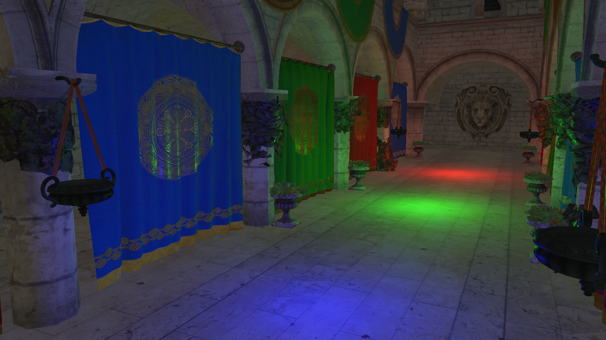

Phoenix 

This is my playground for game engine development and research. 
I work on this is in my free time, so the progress is going to be slow.
In the long run, I'm working towards implementing a small game idea I have, so basically any features I need for that I build here.
Unless I deem it to be too much work, or not interesting, I try to build as much as possible from scratch.

[Trello](https://trello.com/b/exs4s9YZ/phoenix-engine)

Obligatory In-Development Screenshot: 

Some current features highlighted. All of this has been implemented by hand. This doesn't mean that it's better than the other solutions out there (actually quite unlikely), but it does mean that I've acquired quite a lot of experience and knowledge when it comes to these topics. 
* Loading of .obj files
* A RenderBackend abstraction designed for multiple Graphics APIs. OpenGL support is currently being implemented, DirectX follows after that.
* A command-based, stateless approach to rendering sitting atop RenderBackend.
* Loading of .obj files.
* A custom math library.
* A few custom memory allocators and utility functions.
* A custom window implementation (currently only for Windows).